<h1 align="center">Hi 👋, I'm Anirudh Anupkumar</h1>
<h3 align="center">A passionate 15 year old developer from India</h3>
 
 

- 💬 𝙰𝚜𝚔 𝙼𝚎 𝙰𝚋𝚘𝚞𝚝 𝙰𝚗𝚢𝚝𝚑𝚒𝚗𝚐 [here](https://github.com/qwe123coder/qwe123coder/issues/new) ! 𝙸 𝚊𝚖 𝚑𝚊𝚙𝚙𝚢 𝚝𝚘 𝚑𝚎𝚕𝚙.
- 😄 𝙿𝚛𝚘𝚗𝚘𝚞𝚗𝚜 : **𝙷𝚎/𝙷𝚒𝚖/𝙷𝚒𝚜**
- fun fact : I am born on jan 1
 
 
 
 
<!---

<h3 align="left">Languages and Tools:</h3> 
 
<code></code>
<code></code>
<code></code>
<code></code>
<code></code>
<code></code>
<code></code>
<code></code>

<code></code>
<code></code>
<code></code>
<code></code>
<code></code>
<code></code>

 
 
 
 
-->

 <h3>Some Cool Github Stats:</h3> 
 

  
  
  
 

